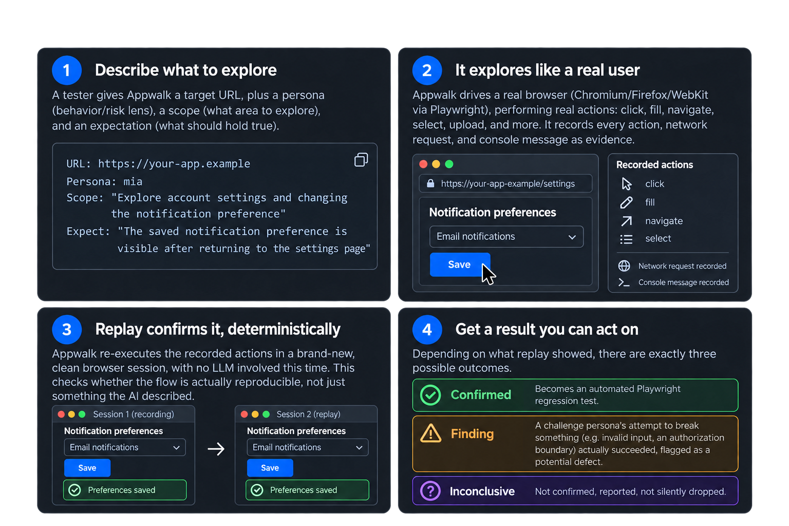

# Appwalk

[](https://www.npmjs.com/package/@kubstack/appwalk)
[](https://github.com/kubstack/appwalk/actions/workflows/ci.yml)

Appwalk is an AI-powered CLI for turning browser exploration into verified Playwright regression tests.

It lets a tester describe how an application should be explored, observes the real interface and network traffic, verifies discovered journeys by replaying them in a clean browser session, and generates executable Playwright tests from the flows that survived verification.

## Why Appwalk

Writing end-to-end coverage usually starts with a tester already knowing the exact journey and locator details. Appwalk starts one level earlier: it discovers meaningful user journeys in an application and preserves the evidence needed to decide whether a journey is stable enough to become regression coverage.

The generated test is not based on an LLM description alone. A flow must be locally verified during exploration and then confirmed by deterministic replay before it is generated. When enabled, captured same-origin JSON responses can also be replayed as fixtures so dynamic data does not make the generated test depend on a changing backend response.

## When to use appwalk

Reach for appwalk when you need new test coverage, not as something wired into every commit:

- **Bootstrapping an untested app.** You inherit or own an application with thin or no E2E coverage. Scope Appwalk at the areas that matter and let it produce a first, replay-confirmed regression suite instead of writing one by hand.
- **After shipping a feature.** Scope a discovery run at the new area instead of writing its first tests by hand.
- **Answering a specific question.** You already know what should hold. Write the scope and expectation directly, and get a flow only if that condition was actually exercised, not just asserted.
- **Checking a specific boundary.** Pick the challenge persona for the concern you actually have (broken auth, a race condition, invalid input) rather than running everything and hoping something turns up. A replay-confirmed failure becomes a finding; anything else is reported as inconclusive.
- **Planning coverage across personas.** Lay out several named runs in `runs`, with different personas, scopes, or accounts, as one deliberate plan, and run them together in one execution.

Each of these is a deliberate choice, not a continuous process: the exploration itself is LLM-driven, so you run it when you decide it's worth it. What comes out the other side costs nothing to keep, though. Once a flow is replay-confirmed, the generated test is an ordinary, deterministic Playwright spec with no LLM involved in running it, and it lives in your existing test suite from then on.

## How it works



See [Architecture](docs/architecture.md) for the full pipeline, including evidence capture, response scenarios, and report generation.

The core terms are deliberately simple:

| Term                | Meaning                                                                                                                                                                  |
| ------------------- | ------------------------------------------------------------------------------------------------------------------------------------------------------------------------ |
| Persona             | The behavior and risk lens used by the agent during exploration. Journey personas act as normal users; challenge personas deliberately probe defenses.                   |
| Scope               | A natural-language area or objective that guides exploration.                                                                                                            |
| Expectation         | A user-visible condition that should hold within the scope. Multiple expectations can be attached to one scope.                                                          |
| Flow                | One meaningful sequence of browser actions with a terminal outcome.                                                                                                      |
| Replay confirmation | Deterministic re-execution of a discovered flow in a clean session.                                                                                                      |
| Finding             | A replay-confirmed case where a challenge persona's probing attempt succeeded: a potential application defect, reported alongside generated tests, not in place of them. |
| Response scenario   | A derived flow made by patching an observed JSON response and checking the resulting UI behavior.                                                                        |

## Quick start

Requirements: Node.js 24 or newer, a Playwright browser installation, and an API key for the selected hosted provider.

```bash
npx playwright install chromium  # add firefox/webkit too if you plan to pass --browser

PROVIDER="your-provider"  # openai, anthropic, gemini, grok, or ollama
MODEL="your-model"
npx @kubstack/appwalk run https://your-app.example \
  --provider "$PROVIDER" \
  --model "$MODEL" \
  --persona mia \
  --max-steps 25
```

For a hosted provider, set its provider-specific credential first: `OPENAI_API_KEY`, `ANTHROPIC_API_KEY`, `GEMINI_API_KEY`, or `XAI_API_KEY`. Ollama uses a local server and does not require an API key. See [Getting started](docs/getting-started.md#2-choose-a-provider) for the complete table.

`run` performs exploration, replay verification, report generation, and Playwright test generation in one execution. Every execution gets its own timestamped directory under `./appwalk-output`.

For a reusable setup, pass a configuration file explicitly:

```bash
npx @kubstack/appwalk run --config ./appwalk.config.yaml
```

Appwalk does not auto-discover a config file. `--config` is always required when YAML configuration should be used. See [Configuration](docs/configuration.md).

## Commands

| Command                    | Use it when                                                             | Produces                                                                     |
| -------------------------- | ----------------------------------------------------------------------- | ---------------------------------------------------------------------------- |
| `run <url>`                | You want the complete pipeline.                                         | HTML/JSON report, evidence, discovery bundle, and tests for confirmed flows. |
| `explore <url>`            | You want discovery and reporting without generating a test suite.       | HTML/JSON report, evidence, and discovery bundle.                            |
| `generate <discovery-dir>` | You already have a discovery bundle and want to generate tests from it. | A Playwright spec for replay-confirmed flows.                                |

Examples:

```bash
# Explore only; no generated spec is written.
PROVIDER="your-provider"
MODEL="your-model"
npx @kubstack/appwalk explore https://your-app.example \
  --provider "$PROVIDER" --model "$MODEL" --persona mia --max-steps 25

# Generate all replay-confirmed flows from a previous execution.
npx @kubstack/appwalk generate ./appwalk-output/<execution-id>

# Generate only selected confirmed flow IDs.
npx @kubstack/appwalk generate ./appwalk-output/<execution-id> --flows 1,3
```

Use `run` for exploration plus generation, and run the generated spec with Playwright when you want to execute the resulting regression tests.

## What to read next

- [Getting started](docs/getting-started.md) - first run, authentication, and running generated tests.
- [Commands and options](docs/commands.md) - complete CLI reference.
- [Configuration](docs/configuration.md) - explicit YAML configuration and multi-person coverage.
- [Personas and exploration](docs/personas.md) - persona intent, scope, expectations, and response scenarios.
- [Reports and artifacts](docs/reports.md) - output layout, flow results, evidence, and CI behavior.
- [Troubleshooting](docs/troubleshooting.md) - common failures and how to interpret them.
- [Architecture](docs/architecture.md) - implementation boundaries for contributors.

## Safety defaults

Appwalk blocks `POST`, `DELETE`, `PUT`, and `PATCH` requests by default during application exploration and replay. This protects the target from unintended mutations, but it also means mutation-heavy journeys may stop or appear incomplete.

Use `--allow-destructive` only against a disposable environment when the side effect is intentional. A safety configuration can add URL-based `allow` and `block` rules; see [Configuration](docs/configuration.md#safety).

## Supported providers

| Provider  | Credential          | Notes                                            |
| --------- | ------------------- | ------------------------------------------------ |
| OpenAI    | `OPENAI_API_KEY`    | Hosted provider.                                 |
| Anthropic | `ANTHROPIC_API_KEY` | Hosted provider.                                 |
| Gemini    | `GEMINI_API_KEY`    | Hosted provider.                                 |
| Grok      | `XAI_API_KEY`       | Hosted provider.                                 |
| Ollama    | None                | Uses a local server at `http://localhost:11434`. |

The provider and model are mandatory. Appwalk intentionally does not choose a hidden model default.

## Development

```bash
npm install
npx playwright install chromium
```

See [CONTRIBUTING.md](.github/CONTRIBUTING.md) for the full pre-PR checklist (typecheck, lint, format, tests) and commit/PR conventions. The test suite is local and does not call an LLM or external application. Generated tests are intentionally separate from Appwalk's own tests; they live inside an execution directory and target the application you explored.

Changes should preserve the CLI/config contract, keep sensitive values out of logs and committed files, and add focused tests for behavioral changes. See [Architecture](docs/architecture.md) for the module boundaries and [Reports and artifacts](docs/reports.md) for the output contract.

## Project status

Appwalk is early-stage and actively developed. The public contract is the CLI behavior, generated artifacts, and report schema. Provider capabilities and generated test quality vary by target application and should be validated before adopting the output as production coverage.
